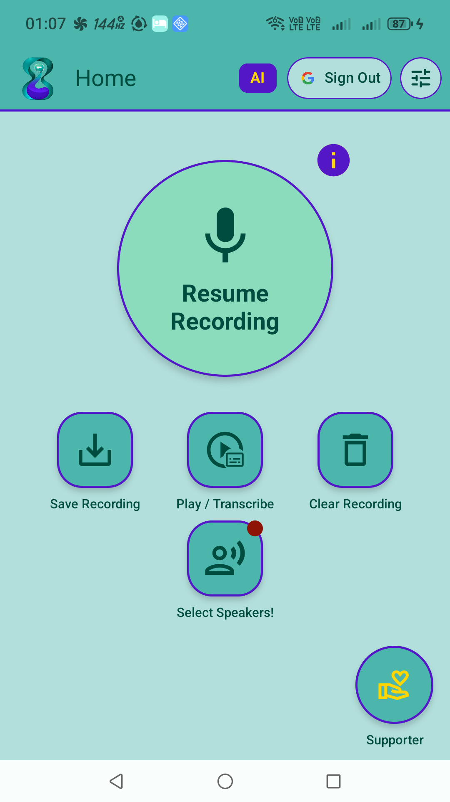
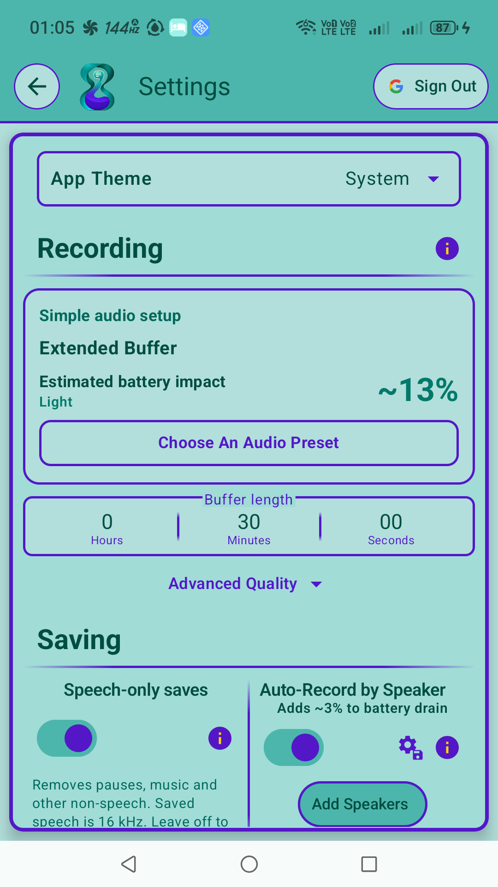
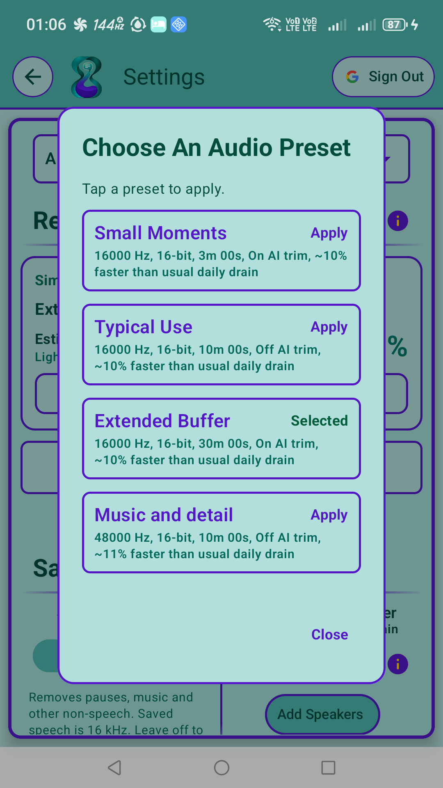
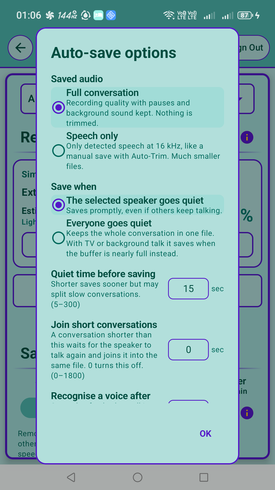
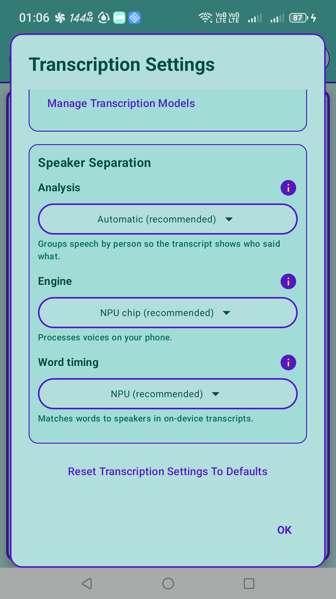
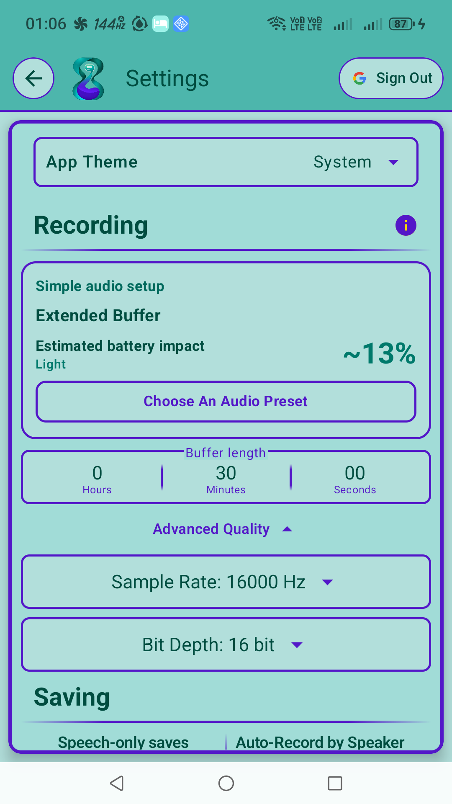
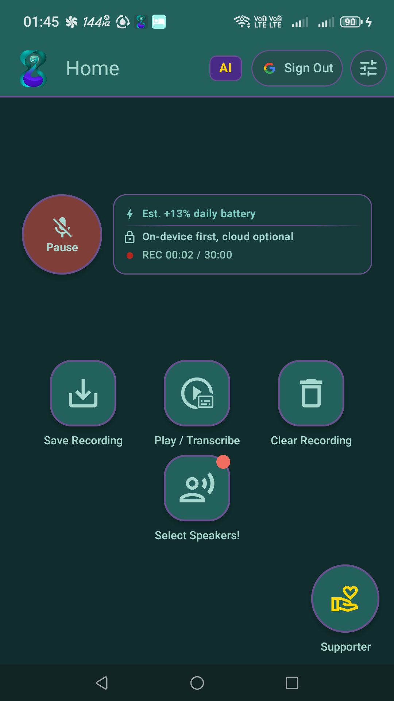

# Auto Record Moments

Catch the conversation you wish you'd recorded. Keep a rolling audio buffer on your Android
phone, then save the moments that matter from the recent past. Start with a preset or fine-tune
recording quality, automatic saving and transcription to suit your day.

**[Website](https://mortenfc.github.io/AutoRecordMoments/)** ·
[User guide](https://mortenfc.github.io/AutoRecordMoments/guide.html) ·
[Account deletion](https://mortenfc.github.io/AutoRecordMoments/account-deletion.html) ·
[Privacy policy](https://mortenfc.github.io/AutoRecordMoments/privacy.html)

## About this repository

This public repository hosts the website and user documentation, alongside the older app's
source code. Current development takes place in the private `AutoRecordMomentsPro` repository.
The features below describe the current app, not everything available in the older public
source or an older installed release. Availability depends on your app version and phone.

## Capture more, your way

- **Save the recent past:** start the rolling recorder, then save from the app or notification.
- **Auto-save by speaker:** enroll a voice and automatically save its conversations.
- **Keep the atmosphere or just the speech:** preserve pauses and background sound, or trim
  non-speech when saving.
- **Turn audio into text:** choose on-device or cloud transcription with speaker labels.
  Available models and CPU, GPU or NPU acceleration depend on your phone.

## Plenty of room to customize

Choose **Small Moments**, **Typical Use**, **Extended Buffer** or **Music and detail**, then
make the setup your own:

- **Recording:** set buffer duration, sample rate and bit depth, with estimates for memory,
  file size and battery impact.
- **Automatic saving:** choose full audio or speech only, save when one speaker or everyone
  goes quiet, and adjust the silence before saving.
- **Conversation flow:** join short conversations and choose how long to wait for more speech.
- **Voice recognition:** adjust how long someone must speak and how many voice matches trigger
  saving.
- **Transcription:** select on-device processing, cloud fallback with upload confirmation, or
  always-cloud processing; choose language, speaker separation, supported timing options and
  cloud model. Enable on-device transcription after saving where supported.

[Explore the settings in the user guide](docs/guide.html).

## Get started

1. Allow microphone and notification access, then confirm Start recording. Choose a folder when you first save, or before using automatic saving.
2. Pick an audio preset and how much recent audio to keep.
3. Start recording, then save when something matters. New audio replaces old audio in the
   temporary buffer until you save it; automatic saving is a separate option.

On-device processing works offline after the models download. Cloud processing uses credits
and uploads selected audio. Signing in synchronizes settings and speaker profiles, including
speaker samples where present. See the [privacy policy](docs/privacy.html) for details.

## Support and account deletion

Email [mortenfjordchristensen@gmail.com](mailto:mortenfjordchristensen@gmail.com) for help.
In the current app, open **Settings → Account & privacy → Delete Account Permanently** and confirm.
Without the app, email the same support address from your sign-in email with the subject
**Account deletion request**; ownership may need to be verified.
Account deletion does not delete recordings in your phone's chosen folder, and limited payment,
deleted-account and starter-credit prevention records remain.
[Read the full deletion instructions](docs/account-deletion.html).

## Current app screenshots

Captured from the 3.0.0 development build on 8 October 2026 (UTC). Features and models vary by device.

  
  
  
  
  
  
  

[Full-size screenshots, download and capture details](docs/screenshots/2026-10-08/README.md).

## Source license

The source code in this repository is licensed under the GNU Affero General Public License v3.0;
see [LICENSE](LICENSE).
